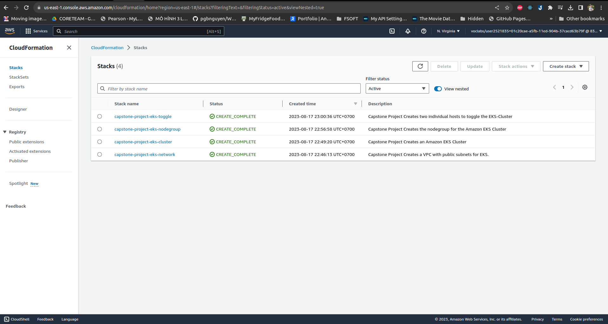
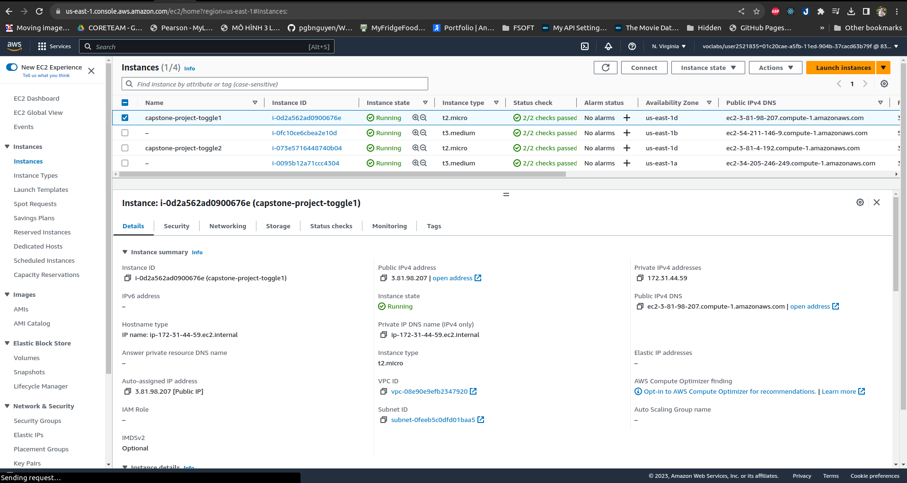
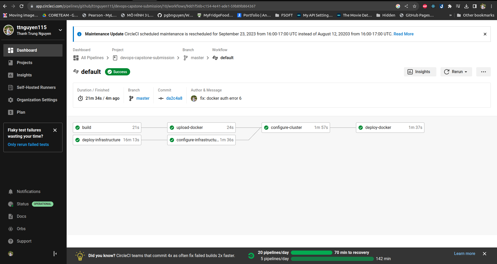
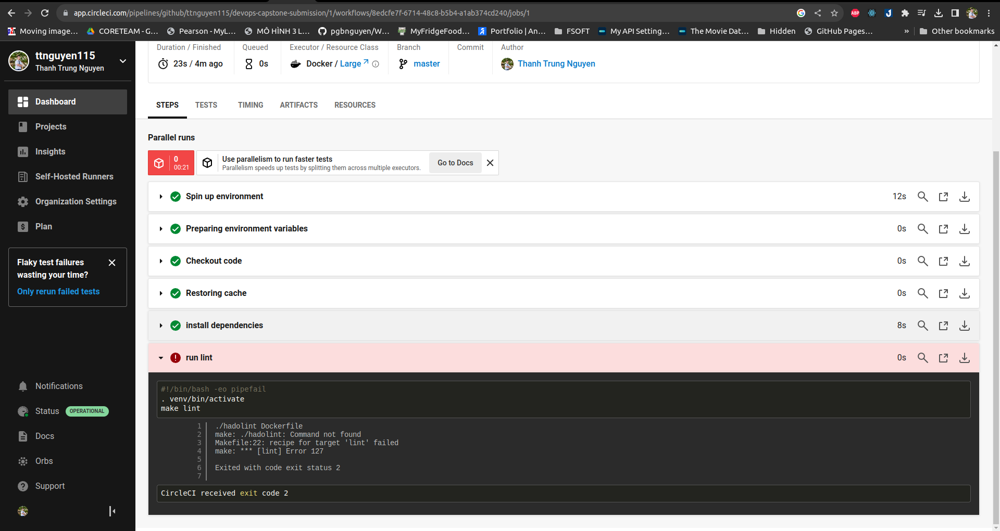
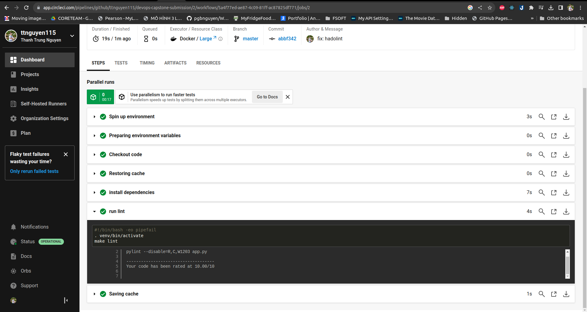
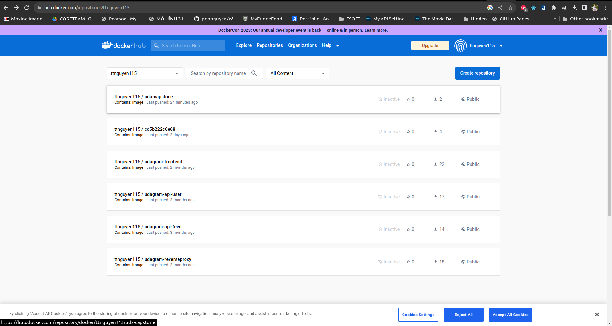
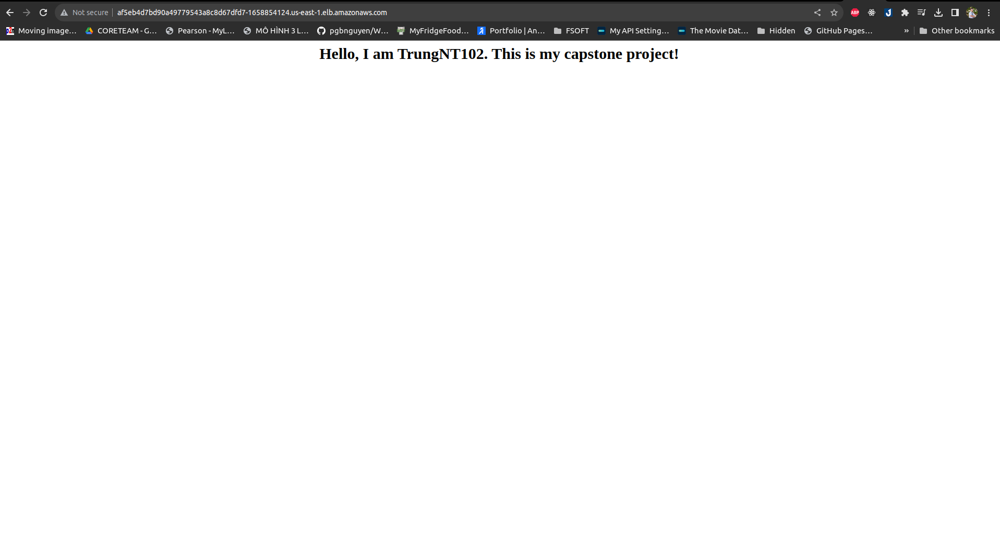

# Cloud DevOps Engineer Capstone Project

This project represents the successful completion of the last final Capstone project and the Cloud DevOps Engineer Nanodegree at Udacity.
- Github: https://github.com/ttnguyen115/devops-capstone-submission
- Docker: https://hub.docker.com/repository/docker/ttnguyen115/uda-capstone/general
- CircleCI: [](https://app.circleci.com/pipelines/github/ttnguyen115/devops-capstone-submission)
## What did I learn?

In this project, I applied the skills and knowledge I developed throughout the Cloud DevOps Nanodegree program. These include:
- Using Circle CI to implement Continuous Integration and Continuous Deployment
- Building pipelines
- Working with Ansible and CloudFormation to deploy clusters
- Building Kubernetes clusters
- Building Docker containers in pipelines
- Working in AWS

## Application

The Application is based on a python3 script using <a target="_blank" href="https://flask.palletsprojects.com">flask</a> to render a simple webpage in the user's browser (and base on project 4).
A requirements.txt is used to ensure that all needed dependencies come along with the Application.

## Kubernetes Cluster

I used AWS CloudFormation to deploy the Kubernetes Cluster.
The CloudFormation Deployment can be broken down into four Parts:
- **Networking**, to ensure new nodes can communicate with the Cluster
- **Elastic Kubernetes Service (EKS)** is used to create a Kubernetes Cluster
- **NodeGroup**, each NodeGroup has a set of rules to define how instances are operated and created for the EKS-Cluster
- **Toggle** is needed to configure and manage the Cluster and its deployments and services. I created two management hosts for extra redundancy if one of them fails.

#### List of deployed Stacks:


#### List of deployed Instances:


## CircleCi - CI/CD Pipelines

I used CircleCi to create a CI/CD Pipeline to test and deploy changes manually before they get deployed automatically to the Cluster using Ansible.

#### From Zero to Hero demonstration:



## Linting using Pylint and Hadolint

Linting is used to check if the Application and Dockerfile is syntactically correct.
This process makes sure that the code quality is always as good as possible.

#### This is the output when the step fails:




#### This is the output when the step passes:



## Upload Docker Image After Successful Build



## Access the Application

After the EKS-Cluster has been successfully configured using Ansible within the CI/CD Pipeline, I checked the deployment and service log on pipeline as follows:

```
    ##TASK [Get deployment] **********************************************************
    changed: [3.81.98.207] => {
        "changed": true,
        "cmd": "./bin/kubectl get deployments",
        "delta": "0:00:00.896526",
        "end": "2023-08-17 16:07:30.639577",
        "invocation": {
            "module_args": {
                "_raw_params": "./bin/kubectl get deployments",
                "_uses_shell": true,
                "argv": null,
                "chdir": "/root",
                "creates": null,
                "executable": null,
                "removes": null,
                "stdin": null,
                "stdin_add_newline": true,
                "strip_empty_ends": true,
                "warn": false
            }
        },
        "msg": "",
        "rc": 0,
        "start": "2023-08-17 16:07:29.743051",
        "stderr": "",
        "stderr_lines": [],
        "stdout": "NAME                          READY   UP-TO-DATE   AVAILABLE   AGE\n****************-deployment   2/2     2            2           2m45s",
        "stdout_lines": [
            "NAME                          READY   UP-TO-DATE   AVAILABLE   AGE",
            "****************-deployment   2/2     2            2           2m45s"
        ]
    }

    ##TASK [Get service] *************************************************************
    changed: [3.81.98.207] => {
        "changed": true,
        "cmd": "./bin/kubectl get services",
        "delta": "0:00:00.868470",
        "end": "2023-08-17 16:07:31.838327",
        "invocation": {
            "module_args": {
                "_raw_params": "./bin/kubectl get services",
                "_uses_shell": true,
                "argv": null,
                "chdir": "/root",
                "creates": null,
                "executable": null,
                "removes": null,
                "stdin": null,
                "stdin_add_newline": true,
                "strip_empty_ends": true,
                "warn": false
            }
        },
        "msg": "",
        "rc": 0,
        "start": "2023-08-17 16:07:30.969857",
        "stderr": "",
        "stderr_lines": [],
        "stdout": "NAME                       TYPE           CLUSTER-IP      EXTERNAL-IP                                                               PORT(S)        AGE\n****************-service   LoadBalancer   10.100.28.192   af5eb4d7bd90a49779543a8c8d67dfd7-1658854124.*********.elb.amazonaws.com   80:32682/TCP   2m44s\nkubernetes                 ClusterIP      10.100.0.1      <none>                                                                    443/TCP        12m",
        "stdout_lines": [
            "NAME                       TYPE           CLUSTER-IP      EXTERNAL-IP                                                               PORT(S)        AGE",
            "****************-service   LoadBalancer   10.100.28.192   af5eb4d7bd90a49779543a8c8d67dfd7-1658854124.*********.elb.amazonaws.com   80:32682/TCP   2m44s",
            "kubernetes                 ClusterIP      10.100.0.1      <none>                                                                    443/TCP        12m"
        ]
    }   
```

Public LB DNS: http://af5eb4d7bd90a49779543a8c8d67dfd7-1658854124.us-east-1.elb.amazonaws.com/\

